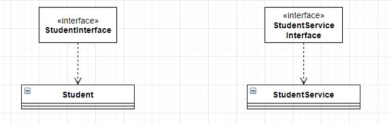

Laboratory work on the discipline "Cross-Platform Programming"

# UML-diagram class

  

# IDE

IntelliJ IDEA 2020.3.2

# JDK-version

Java 1.8

## License

[MIT](https://opensource.org/licenses/MIT)
